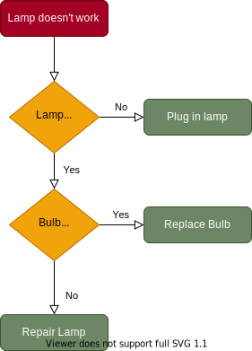
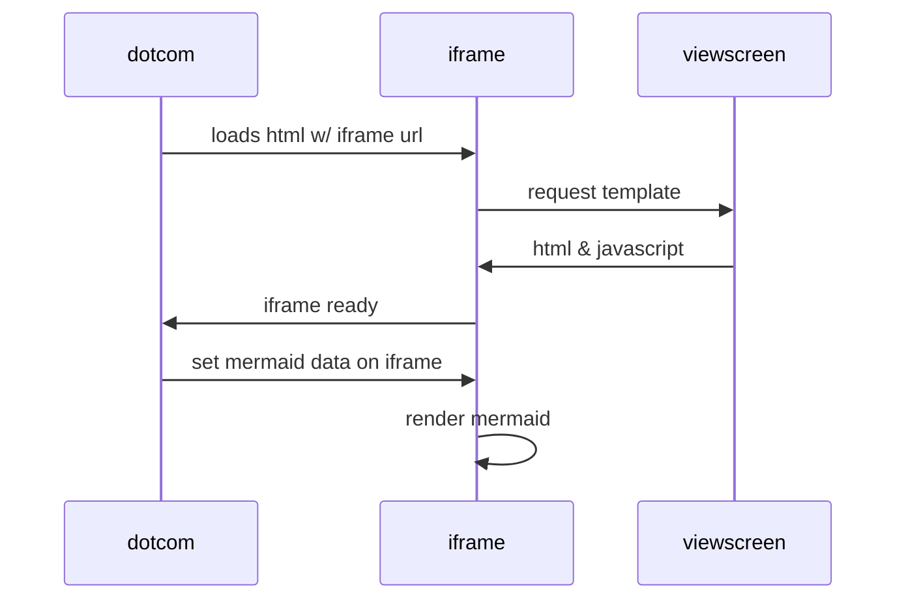
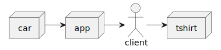

# ebike-architecture-model

# 1. Diagrams as embeded svg 

Diagram like down below can be edited by [IntelliJ plugin for Diagrams.net](https://plugins.jetbrains.com/plugin/15635-diagrams-net-integration) or [VS Code plugin for Diagrams.net](https://marketplace.visualstudio.com/items?itemName=hediet.vscode-drawio).




# 2. Diagrams as code

## 2.1. Mermaid.js

Supported out of the box by:  
[GitHub](https://github.blog/2022-02-14-include-diagrams-markdown-files-mermaid)
([ this example](https://github.com/mjurincic/ebike-architecture-model/blob/main/README.md))
[~~Bitbucket~~](https://community.atlassian.com/t5/Bitbucket-questions/Bitbucket-Wikis-Mermaid-support/qaq-p/1102749)
[GitLab](https://about.gitlab.com/handbook/tools-and-tips/#using-mermaid)

More info:  
Docs:  
https://github.com/mermaid-js/mermaid  
Book:  
https://mermaid-js.github.io/mermaid/landing/  
Live editor:  
https://mermaid.live/edit#pako:eNpVkM-KwkAMxl8l5OSCfYEeBG3Vi6Cgt46H0InOIPOHdMoibd99p5aF3ZyS7_t9IWTANmjGEp9C0cCtVh5ybZvKiO2So-4ORbEZj5zABc_vEXarY4DOhBitf34t_G6GoBpOM8aQjPWvabGqT_7seYS6OVFMId7_OrfvMMK-sReT1_93jHBOHZoHlQ8qWhKoSD4IrtGxOLI6nz7MisJk2LHCMrea5KVQ-SlzfdSUeK9tCoJlkp7XSH0K17dvf-eFqS3lL7hFnH4ABg5bBA  
Codepen:  
https://codepen.io/Pinjasaur/pen/mdqXJVz  
CLI:  
https://github.com/mermaid-js/mermaid-cli  

````
Here is a simple flow chart:

````

Here is a simple flow chart:


````
Here is a simple sequence diagram:

````

Here is a simple sequence diagram:


With links embedded
````

````


## 2.2. PlantUML

Supported out of the box by:  
[GitLab](https://docs.gitlab.com/ee/administration/integration/plantuml.html)(This feature is currently only available with on-prem installations of GitLab)

### GitLab integration

You have to [set up](https://gitlab.com/gitlab-org/gitlab-ce/blob/master/doc/administration/integration/plantuml.md) a render server to use and you can just commit Markdown files with inlined PlantUML diagrams and they will render for everyone visiting the GitLab web UI.

Markdown files with online plantuml:

```plantuml
Bob -> Alice : hello
Alice -> Bob : hi
```


### GitHub integration

Example project showing how to use PlantUML and embed UML diagrams into a markdown

1. A PlantUML editor -  use [VS Code plugin for PlantUML](https://marketplace.visualstudio.com/items?itemName=jebbs.plantuml) or [IntelliJ plugin for PlantUML](https://plugins.jetbrains.com/plugin/7017-plantuml-integration/) or online editor like [planttext.com](https://planttext.com/) or [plantuml.com](http://www.plantuml.com/plantuml/uml/) or host your own on-premise with the [plantUML Docker image](https://hub.docker.com/r/plantuml/plantuml-server/))
2. Integrate PlantUML render engine with markdown

#### 1. A PlantUML editor

Visit the online editor [http://www.plantuml.com/plantuml/uml/](http://www.plantuml.com/plantuml/uml/) and write your UML diagram with code & use a cheat sheet like this: https://ogom.github.io/draw_uml/plantuml/

This project contains an example [example-uml.puml](example-uml.puml):

```
@startuml
actor client
node app
node car
node tshirt

car -> app
app -> client
client -> tshirt
@enduml
```


#### 2. Integrate PlantUML render engine with GitHub markdown

Use the PlantUML proxy `http://www.plantuml.com/plantuml/proxy` or selfhosted version to render your `*.puml` files and embed them like images:

```

``` 

Use the `RAW` version of your `*.puml` files like that: [https://raw.githubusercontent.com/mjurincic/ebike-architecture-model/main/example-uml.puml](https://raw.githubusercontent.com/mjurincic/ebike-architecture-model/main/example-uml.puml) and prefix it with `src=`.

Also you should use the `cache=no` option so that GitHub always renders the currently committed version of your PlantUML `*.puml` files.

Diagram live rendered:


### Local

There are two fundamental ways of keeping PlantUML diagrams

  1. inline into Markdown
  2. keep as individual .puml files and prerender .png/.svg


#### 1. inline into Markdown  
Has been shown above eaither inline or as adhoc rendered image

#### 2. keep as individual .puml files and prerender .png/.svg

Simliar to SVG workflow use plugin for editor either [VS Code plugin for PlantUML](https://marketplace.visualstudio.com/items?itemName=jebbs.plantuml) or [IntelliJ plugin for PlantUML](https://plugins.jetbrains.com/plugin/7017-plantuml-integration/)
to create and edit `*.puml` diagrams than run conversion process either as pipline or local example script given in this repo
`convert-with-jar.sh`, `convert-with-docker.sh` and embed resulting .svg/.png

```

```


### Other stuff
[Markdown Preview Enhanced](https://shd101wyy.github.io/markdown-preview-enhanced/#/) for Atom and VS Code can render mermaid and PlantUML

## Summary 
Plant UML is definitely more mature (older) and has wider support of UML and 
different kinds of diagrams. It is not implemented in a "modern way" using javascript, 
but java. That might be the advantage or not depending on needs and could be somehow more complex 
to run locally for individuals or smaller teams. 

dodaj markdown komentare formater na pocetku dokumenta


